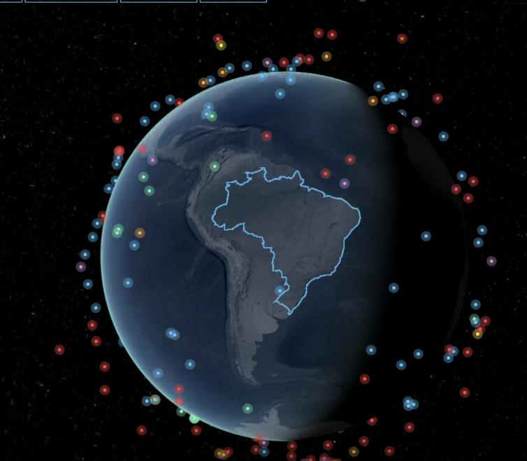

build a satallite tracker in JS and HTML using the Stack: Cesium + satellite.js + CelesTrak API no backend - pure frontend. - the tracker will show all StarLink DTC satallites with their version and on mouse over - a small window will open with a picture and specifics of the satellite. ie V3 = 150 Mbits of data
i'm interested in the 330 km orbit 
i'm waiting for the first launch of the V3 which should be the 4th quarter 2026 and want to be the first to track it.

lets do a POC with Strlink DTC at 550 km orbit to check function.

